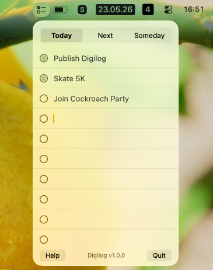

# Digilog

A minimal macOS menu bar task list, inspired by [Ugmonk Analog](https://ugmonk.com/en-de/pages/analog).

Download the latest releases from <https://github.com/captn3m0/digilog/releases/latest>. Homebrew Cask coming soon.

.

Three tabs — **Today**, **Next**, **Someday** — each with 10 fixed rows. State lives as plain markdown files in `~/Documents/Digilog/`.

## Use

Click the checklist icon in the menu bar. Type into any row, check off items as you go. That's it.

Files are written to `~/Documents/Digilog/` as you type:

```
~/Documents/Digilog/
├── 2026-05-22.md   # Today, keyed by logical date (now − 4h)
├── NEXT.md
└── SOMEDAY.md
```

You can edit those files in any text editor — changes show up next time you open the popover.

You can double click on "Next/Someday" to change to a new card. Today is limited to just 10 items,
but once you run out of space on Next/Someday card, you can get a new one. The older cards are
preserved in the NEXT.md file, but moved below.

# License

The code is fairly minimal (250 lines of Swift) and written using Claude Opus 4.7. I don't think
code generated by LLMs should be copyright-able. Hence, this is explicitly marked as Unlicense.